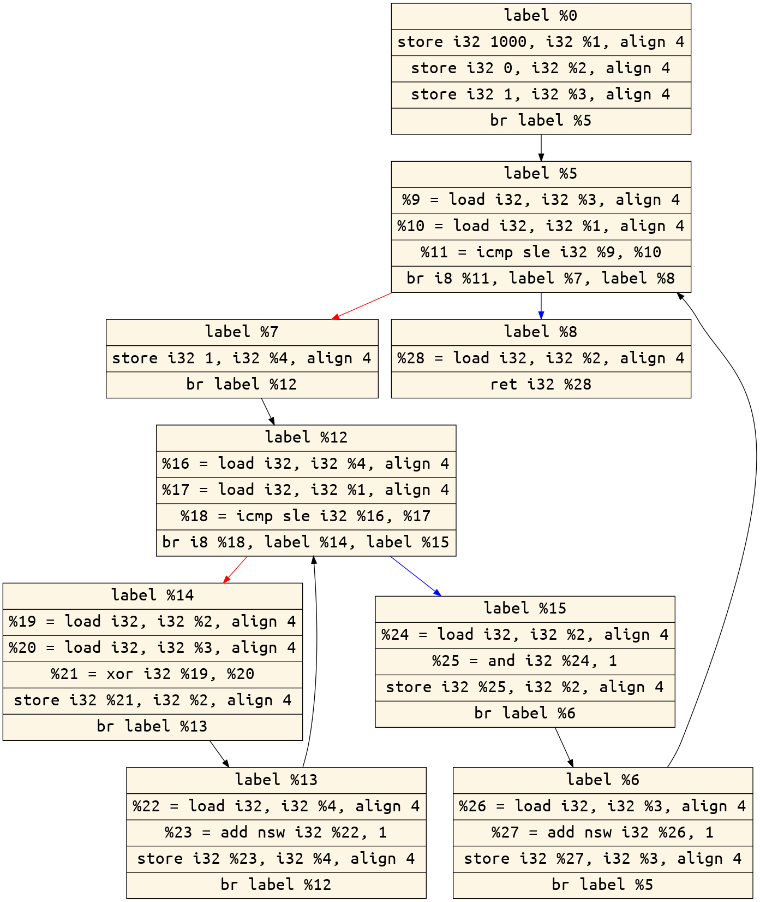
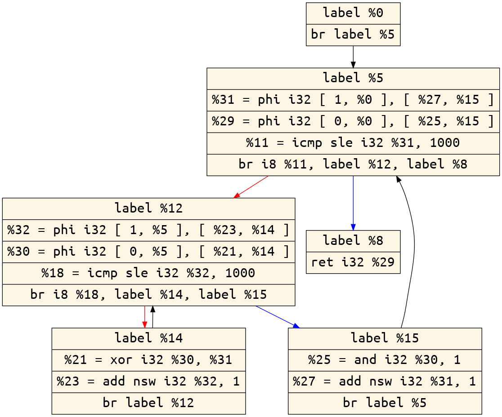

## Sample

### C++ Code

```c++
int main() {
  int n = 1000;
  int sum = 0;
  int i;
  int j;
  for (i = 1; i <= n; ++i) {
    for (j = 1; j <= n; ++j)
      sum = sum ^ i;
    sum = sum & 1;
  }
  return sum;
}
```

### Optimization process

#### No Opt


#### Peephole


#### Mem2Reg

